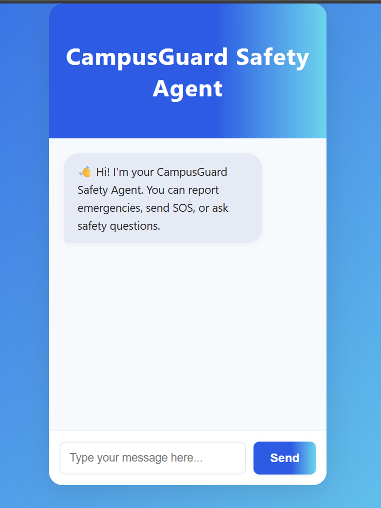
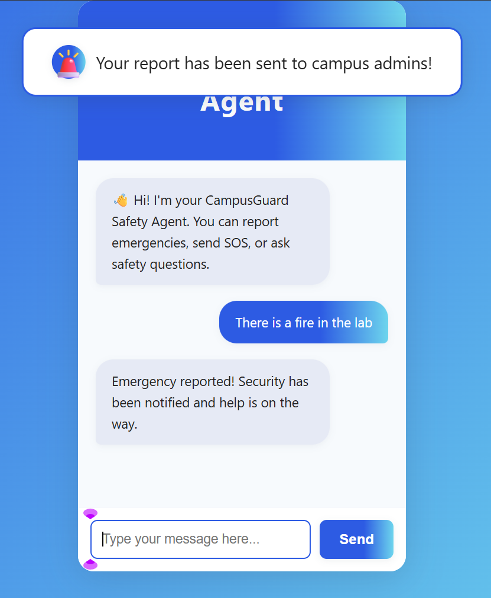
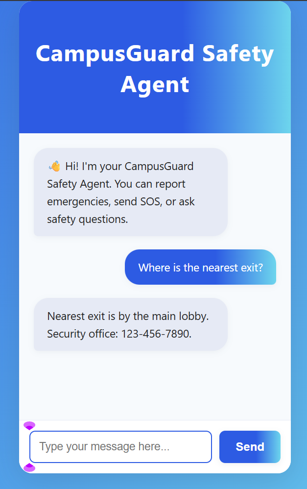
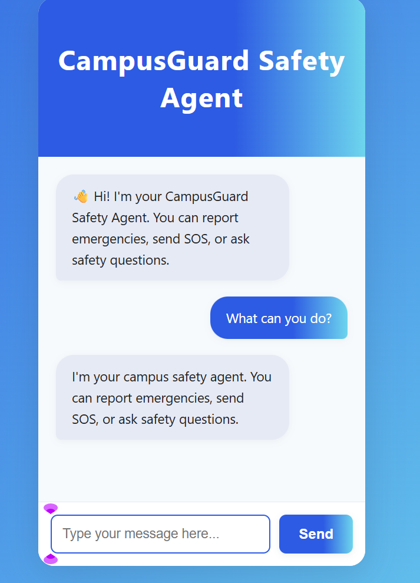

# AI-Powered Campus Safety & Security Monitoring

## 🚨 Problem Statement

Campus safety is a critical concern for students, parents, and administrators. Traditional reporting methods are slow and inefficient, and security teams often lack real-time information about emergencies or unusual activities. There is a need for a fast, interactive, and intelligent system to empower students and enable proactive campus security.

## 🚧 Current Progress Status

- ✅ Chatbot UI and logic for emergency reporting, SOS, and FAQs (Completed)
- ✅ AI surveillance script for motion/unusual activity detection (Completed)
- ⏳ Integration between chatbot and backend (Pending)
- ⏳ Admin dashboard for real-time alerts (Basic prototype pending)
- ⏳ Full deployment and advanced AI models (Pending)

## 💡 How Our Prototype Solves the Problem

- **For Students:** A web-based chatbot allows instant reporting of emergencies, sending SOS alerts (with location/ID), and getting safety information.
- **For Security/Admins:** AI surveillance analyzes CCTV feeds for unusual activities and triggers alerts. All reports and alerts can be viewed in a dashboard, enabling faster and more effective responses.

## 🛠️ Technologies/Tools Used

- **Frontend:** HTML, CSS, JavaScript
- **AI/Surveillance:** Python, OpenCV
- **Backend (for future integration):** Python (Flask)
- **Version Control:** GitHub

## 📸 Screenshots

### Welcome Message

Displays the initial greeting from the chatbot when a user opens the chat.

---

### Emergency Report

Shows how an emergency report is submitted and acknowledged by the bot.

---

### Safety Information

Example of the bot providing safety-related information in response to a user query.

---

### Default/FAQ Message

Shows the default or FAQ response when the bot receives a general or unsupported question.

---
